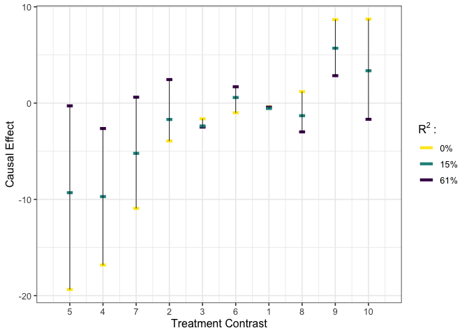
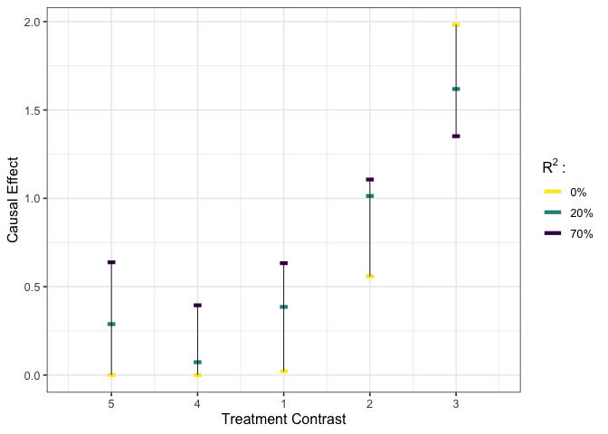
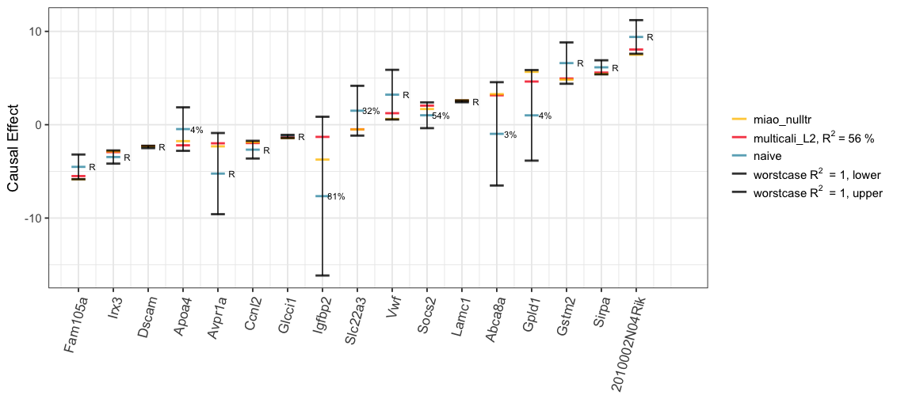

<!-- README.md is generated from README.Rmd. Please edit that file -->

# CopSens

<!-- badges: start -->
<!-- badges: end -->

`CopSens` implements the copula-based sensitivity analysis method, as
discussed in [Copula-based Sensitivity Analysis for Multi-Treatment
CausalInference with Unobserved Confounding](), with Gaussian copula
adopted in particular.

## Installation

You can install the development version from
[GitHub](https://github.com/) with:

``` r
# install.packages("devtools")
devtools::install_github("JiajingZ/CopSens")
```

The dependency `pcaMethods` from [Bioconductor](http://bioconductor.org)
may fail to automatically install, which would result in a warning
similar to:

    ERROR: dependency ‘pcaMethods’ is not available for package ‘CopSens’

Then, please first install the `pcaMethods` manually by

``` r
if (!requireNamespace("BiocManager", quietly = TRUE))
  install.packages("BiocManager")
BiocManager::install("pcaMethods")
```

## Basic Usage

``` r
# load package #
library(CopSens)
```

### Example for analysis with Gaussian outcomes

``` r
# load data #
y <- GaussianT_GaussianY$y
tr <- subset(GaussianT_GaussianY, select = -c(y))

# execute worst-case calibration #
est1 <- gcalibrate(y = y, tr = tr, t1 = tr[1:2,], t2 = tr[3:4,],
                      calitype = "worstcase", R2 = c(0.6, 1))
#> Fitting the latent confounder model by PPCA with default.
#> 1:2:3:4:5:6:7:8:9:10:1:2:3:4:5:6:7:8:9:10:1:2:3:4:5:6:7:8:9:10:1:2:3:4:5:6:7:8:9:10:1:2:3:4:5:6:7:8:9:10:
#> Observed outcome model fitted by simple linear regression with default.
#> Worst-case calibration executed.
# visualize #
plot_estimates(est1$est_df)
```


``` r
# execute multivariate calibration #
est2 <- gcalibrate(y = y, tr = tr, t1 = tr[1:10,], t2 = tr[11:20,],
                      calitype = "multicali", penalty_weight = c(0, 15))
#> Fitting the latent confounder model by PPCA with default.
#> 1:2:3:4:5:6:7:8:9:10:1:2:3:4:5:6:7:8:9:10:1:2:3:4:5:6:7:8:9:10:1:2:3:4:5:6:7:8:9:10:1:2:3:4:5:6:7:8:9:10:
#> Observed outcome model fitted by simple linear regression with default.
#> Multivariate calibration executed.
#> Calibrating with penalty_weight = 0  15
# visualize #
plot_estimates(est2$est_df)
```



``` r
# execute user-specified calibration #
est3 <- gcalibrate(y = y, tr = tr, t1 = tr[1:2,], t2 = tr[3:4,],
                      calitype = "null", gamma = c(0.96, -0.29, 0),
                      R2 = c(0.3, 0.7, 1))
#> Fitting the latent confounder model by PPCA with default.
#> 1:2:3:4:5:6:7:8:9:10:1:2:3:4:5:6:7:8:9:10:1:2:3:4:5:6:7:8:9:10:1:2:3:4:5:6:7:8:9:10:1:2:3:4:5:6:7:8:9:10:
#> Observed outcome model fitted by simple linear regression with default.
#> User-specified calibration executed.
# visualize #
plot_estimates(est3$est_df)
```


### Example for analysis with binary outcomes

``` r
# load data #
y <- GaussianT_BinaryY$y
tr <- subset(GaussianT_BinaryY, select = -c(y))
t1 <- tr[1:5,]
t2 <- rep(0, times = ncol(tr))

# calibrate #
est_df <- bcalibrate(y = y, tr = tr, t = rbind(t1, t2),
                     gamma = c(1.27, -0.28, 0),
                     R2 = c(0.5, 0.7))$est_df
#> Fitting the latent confounder model by PPCA with default.
#> 1:2:3:4:5:6:7:8:9:10:1:2:3:4:5:6:7:8:9:10:1:2:3:4:5:6:7:8:9:10:1:2:3:4:5:6:7:8:9:10:1:2:3:4:5:6:7:8:9:10:
#> Observed outcome model fitted by simple probit model with default.
#> R2 =  0.5 , calibrating observation 1  2  3  4  5  6  
#> R2 =  0.7 , calibrating observation 1  2  3  4  5  6
# calculate risk ratio estimator #
rr_df <- est_df[1:5,] / as.numeric(est_df[6,])
# visualize #
plot_estimates(rr_df)
```



## Implementation To a Mouse Obesity Study

For further illustration, we compare our approach to a recent analysis
of a mouse obesity dataset [Wang et
al. (2006)](https://doi.org/10.1371/journal.pgen.0020015), conducted by
[Miao et al. (2020)](https://arxiv.org/abs/2011.04504). In particular,
we consider the comparison to their null treatments approach, which
assumes that at least half of the confounded treatments have no causal
effect on the outcome.

``` r
# load the data #
y <- micedata[,1]
tr <- micedata[, 2:18]
```

Following [Miao et al. (2020)](https://arxiv.org/abs/2011.04504), we
infer a Gaussian conditional confounder distribution by applying factor
analysis to treatments, and fit the observed outcome distribution with a
linear regression.

``` r
# treatment model #
nfact <- 1
tr_factanal <- factanal(tr, factors=nfact, scores = "regression")
B_hat <- diag(sqrt(diag(var(tr)))) %*% tr_factanal$loadings
Sigma_t_u_hat <- diag(tr_factanal$uniquenesses * sqrt(diag(var(tr))))
u_hat <- tr_factanal$scores
coef_mu_u_t_hat <- t(B_hat) %*% solve(B_hat %*% t(B_hat) + Sigma_t_u_hat)
cov_u_t_hat <- diag(nfact) - t(B_hat) %*% solve(B_hat %*% t(B_hat) + Sigma_t_u_hat) %*% B_hat

# outcome model #
lmfit_y_t <- lm(y ~ ., data = micedata[,1:18])
beta_t <- coef(lmfit_y_t)[-1]
names(beta_t) <- colnames(tr)
sigma_y_t_hat <- sigma(lmfit_y_t)
```

We explore the ignorance regions for each treatment as well as estimate
the treatment effects with multiple contrast criteria (MCCs) using the
method described in []().

``` r
k <- ncol(tr)
t1 <- diag(k)
t2 <- matrix(0, ncol = k, nrow = k)
u_t_diff <- (t1 - t2) %*% t(coef_mu_u_t_hat)

# worst-case calibration #
R2 <- c(0.3, 0.6, 1)
beta_cali_worstcase <- gcalibrate(y, tr, t1 = t1, t2 = t2, calitype = "worstcase",
                                  mu_y_dt = as.matrix(beta_t), sigma_y_t =  sigma_y_t_hat,
                                  mu_u_dt = u_t_diff, cov_u_t = cov_u_t_hat, R2 = R2)$est_df
#> Worst-case calibration executed.
rownames(beta_cali_worstcase) <- names(beta_t)

## multivariate calibration ##
# with L1 norm #
multcali_results_L1 <- gcalibrate(y, tr, t1 = t1, t2 = t2, calitype = "multicali",
                                  mu_y_dt = as.matrix(beta_t), sigma_y_t =  sigma_y_t_hat,
                                  mu_u_dt = u_t_diff, cov_u_t = cov_u_t_hat, normtype = "L1")
#> Multivariate calibration executed.
#> Calibrating with penalty_weight = 0
# with L2 norm #
multcali_results_L2 <- gcalibrate(y, tr, t1 = t1, t2 = t2, calitype = "multicali", 
                                  mu_y_dt = as.matrix(beta_t), sigma_y_t =  sigma_y_t_hat,
                                  mu_u_dt = u_t_diff, cov_u_t = cov_u_t_hat, normtype = "L2")
#> Multivariate calibration executed.
#> Calibrating with penalty_weight = 0
```

We visualize the analysis results below:


The Spearman’s rank correlation between the estimated treatment effects
by [Miao et al. (2020)](https://arxiv.org/abs/2011.04504) with null
treatment assumption (“miao\_nulltr”) and the estimates by our MCC
procedure with the L1 (“multicali\_L1”) or L2 minimization
(“multicali\_L2”) are 0.90 and 0.93 respectively.



The [Miao et al. (2020)](https://arxiv.org/abs/2011.04504)’s causal
effect estimate with null treatment assumption (“miao\_nulltr”) would
correspond to a single point inside the ignorance region (“worstcase
*R*<sup>2</sup> = 1, lower”, “worstcase *R*<sup>2</sup> = 1, upper”)
when the Gaussian copula assumption holds.
