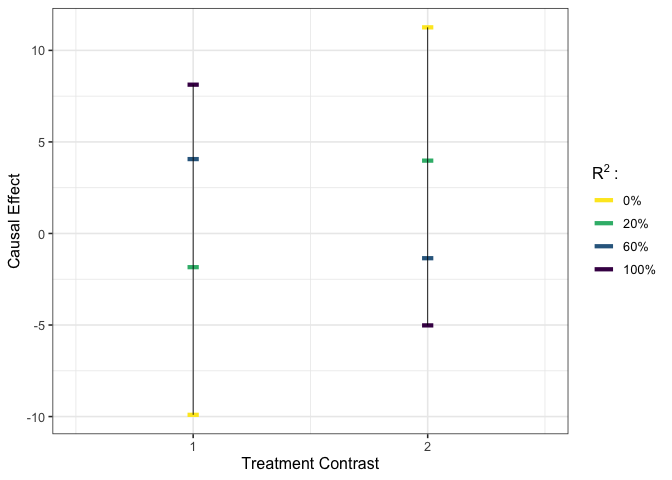
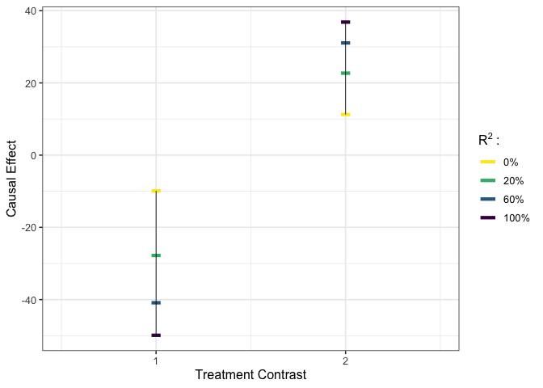
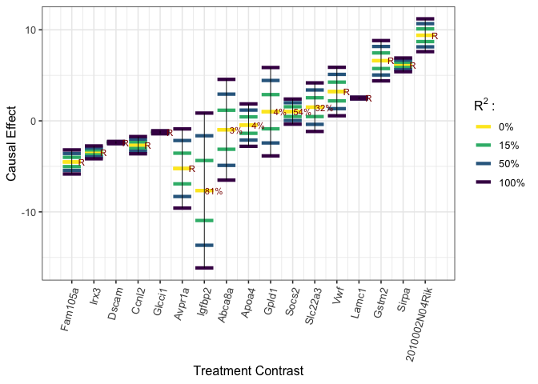

<!-- README.md is generated from README.Rmd. Please edit that file -->

# CopSens

<!-- badges: start -->
<!-- badges: end -->

`CopSens` implements the copula-based sensitivity analysis method, as
discussed in [“Copula-based Sensitivity Analysis for Multi-Treatment
Causal Inference with Unobserved
Confounding”](https://arxiv.org/abs/2102.09412), with Gaussian copula
adopted in particular.

## Installation

You can install the development version from
[GitHub](https://github.com/) with:

``` r
# install.packages("devtools")
devtools::install_github("JiajingZ/CopSens")
```

The dependency `pcaMethods` from [Bioconductor](http://bioconductor.org)
may fail to automatically install, which would result in a warning
similar to:

    ERROR: dependency ‘pcaMethods’ is not available for package ‘CopSens’

Then, please first install the `pcaMethods` manually by

``` r
if (!requireNamespace("BiocManager", quietly = TRUE))
  install.packages("BiocManager")
BiocManager::install("pcaMethods")
```

## Basic Usage

``` r
# load package #
library(CopSens)
```

### Example for analysis with Gaussian outcomes

``` r
# load data #
y <- GaussianT_GaussianY$y
tr <- subset(GaussianT_GaussianY, select = -c(y))

# execute worst-case calibration #
est_g1 <- gcalibrate(y = y, tr = tr, t1 = tr[c(1,2,1698),], tr[c(3,4,6698),],
                     calitype = "worstcase", R2 = c(0.3, 1))
#> Fitting the latent confounder model by PPCA with default.
#> 1:2:3:4:5:6:7:8:9:10:1:2:3:4:5:6:7:8:9:10:1:2:3:4:5:6:7:8:9:10:1:2:3:4:5:6:7:8:9:10:1:2:3:4:5:6:7:8:9:10:
#> Observed outcome model fitted by simple linear regression with default.
#> Worst-case calibration executed.
# visualize #
plot_estimates(est_g1, show_rv = TRUE)
```


``` r
# execute multivariate calibration #
est_g2 <- gcalibrate(y = y, tr = tr, t1 = tr[1:10,], t2 = tr[11:20,],
                     calitype = "multicali", R2_constr = c(1, 0.15))
#> Fitting the latent confounder model by PPCA with default.
#> 1:2:3:4:5:6:7:8:9:10:1:2:3:4:5:6:7:8:9:10:1:2:3:4:5:6:7:8:9:10:1:2:3:4:5:6:7:8:9:10:1:2:3:4:5:6:7:8:9:10:
#> Observed outcome model fitted by simple linear regression with default.
#> Multivariate calibration executed.
#> Calibrating with R2_constr =
#> 1
#> 0.15
#> 
# visualize #
plot_estimates(est_g2)
```


``` r
# execute user-specified calibration #
est_g3 <- gcalibrate(y = y, tr = tr, t1 = tr[1:2,], t2 = tr[3:4,],
                     calitype = "null", gamma = c(0.96, -0.29, 0),
                     R2 = c(0.2, 0.6, 1))
#> Fitting the latent confounder model by PPCA with default.
#> 1:2:3:4:5:6:7:8:9:10:1:2:3:4:5:6:7:8:9:10:1:2:3:4:5:6:7:8:9:10:1:2:3:4:5:6:7:8:9:10:1:2:3:4:5:6:7:8:9:10:
#> Observed outcome model fitted by simple linear regression with default.
#> User-specified calibration executed.
#> 
# visualize #
plot_estimates(est_g3)
```



``` r
# apply gamma that maximizes the bias for the first contrast considered in est_g1 #
est_g4 <- gcalibrate(y = y, tr = tr, t1 = tr[1:2,], t2 = tr[3:4,],
                     calitype = "null", gamma = est_g1$gamma[1,],
                     R2 = c(0.2, 0.6, 1))
#> Fitting the latent confounder model by PPCA with default.
#> 1:2:3:4:5:6:7:8:9:10:1:2:3:4:5:6:7:8:9:10:1:2:3:4:5:6:7:8:9:10:1:2:3:4:5:6:7:8:9:10:1:2:3:4:5:6:7:8:9:10:
#> Observed outcome model fitted by simple linear regression with default.
#> User-specified calibration executed.
#> 
# visualize #
plot_estimates(est_g4)
```



### Example for analysis with binary outcomes

``` r
# load data #
y <- GaussianT_BinaryY$y
tr <- subset(GaussianT_BinaryY, select = -c(y))
t1 <- tr[1:5,]
t2 <- rep(0, times = ncol(tr))

# calibrate #
est_b <- bcalibrate(y = y, tr = tr, t = rbind(t1, t2),
                    gamma = c(1.27, -0.28, 0),
                    R2 = c(0.2, 0.7))
#> Fitting the latent confounder model by PPCA with default.
#> 1:2:3:4:5:6:7:8:9:10:1:2:3:4:5:6:7:8:9:10:1:2:3:4:5:6:7:8:9:10:1:2:3:4:5:6:7:8:9:10:1:2:3:4:5:6:7:8:9:10:
#> Observed outcome model fitted by simple probit model with default.
#> R2 = 0.2, calibrating observation
#> 1
#> 2
#> 3
#> 4
#> 5
#> 6
#> 
#> R2 = 0.7, calibrating observation
#> 1
#> 2
#> 3
#> 4
#> 5
#> 6
#> 
# calculate risk ratio estimator #
est_b_rr <- list(est_df = est_b$est_df[1:5,] / as.numeric(est_b$est_df[6,]),
                 R2 = c(0.2, 0.7))
# visualize #
plot_estimates(est_b_rr)
```


## Implementation To a Mouse Obesity Study

For further illustration, we compare our approach to a recent analysis
of a mouse obesity dataset [(Wang et
al. (2006))](https://doi.org/10.1371/journal.pgen.0020015), conducted by
[Miao et al. (2020)](https://arxiv.org/abs/2011.04504), where the effect
of gene expressions on the body weight of F2 mice is of interest. The
data are collected from 287 mice, including the body weight, 37 gene
expressions, and 5 single nucleotide polymorphisms. Among these 37
genes, 17 are likely to affect mouse weight ([Lin et
al. (2015)](https://pubmed.ncbi.nlm.nih.gov/26392642/)). In our example
here, we focus on estimating the treatment effects of these 17 genes,
and consider the comparison to the null treatments approach from Miao et
al. (2020), which assumes that at least half of the confounded
treatments have no causal effect on the outcome.

``` r
# load the data #
y <- micedata[,1]
tr <- micedata[, 2:18]
```

Following Miao et al. (2020), we infer a Gaussian conditional confounder
distribution by applying factor analysis to treatments, and fit the
observed outcome distribution with a linear regression.

``` r
# treatment model #
nfact <- 1
tr_factanal <- factanal(tr, factors=nfact, scores = "regression")
B_hat <- diag(sqrt(diag(var(tr)))) %*% tr_factanal$loadings
Sigma_t_u_hat <- diag(tr_factanal$uniquenesses * sqrt(diag(var(tr))))
u_hat <- tr_factanal$scores
coef_mu_u_t_hat <- t(B_hat) %*% solve(B_hat %*% t(B_hat) + Sigma_t_u_hat)
cov_u_t_hat <- diag(nfact) - t(B_hat) %*% solve(B_hat %*% t(B_hat) + Sigma_t_u_hat) %*% B_hat

# outcome model #
lmfit_y_t <- lm(y ~ ., data = micedata[,1:18])
beta_t <- coef(lmfit_y_t)[-1]
names(beta_t) <- colnames(tr)
sigma_y_t_hat <- sigma(lmfit_y_t)
```

We explore the ignorance regions for each treatment as well as causal
estimates with multiple contrast criteria (MCCs) using the method
described in [Zheng, D’Amour and Franks
(2021)](https://arxiv.org/abs/2102.09412).

``` r
k <- ncol(tr)
t1 <- diag(k)
t2 <- matrix(0, ncol = k, nrow = k)
u_t_diff <- (t1 - t2) %*% t(coef_mu_u_t_hat)

# worst-case calibration #
R2 <- c(0.15, 0.5, 1)
worstcase_results <- gcalibrate(y, tr, t1 = t1, t2 = t2, calitype = "worstcase",
                                  mu_y_dt = as.matrix(beta_t), sigma_y_t =  sigma_y_t_hat,
                                  mu_u_dt = u_t_diff, cov_u_t = cov_u_t_hat, R2 = R2)
#> Worst-case calibration executed.
rownames(worstcase_results$est_df) <- names(beta_t)
names(worstcase_results$rv) <- names(beta_t)
plot_estimates(worstcase_results, order = "worstcase", labels = names(beta_t),
               axis.text.x = element_text(size = 10, angle = 75, hjust = 1))
```



``` r
## multivariate calibration ##
# with L1 norm #
multcali_results_L1 <- gcalibrate(y, tr, t1 = t1, t2 = t2, calitype = "multicali",
                                  mu_y_dt = as.matrix(beta_t), sigma_y_t =  sigma_y_t_hat,
                                  mu_u_dt = u_t_diff, cov_u_t = cov_u_t_hat, normtype = "L1")
#> Multivariate calibration executed.
#> Calibrating with R2_constr =
#> 1
#> 
# with L2 norm #
multcali_results_L2 <- gcalibrate(y, tr, t1 = t1, t2 = t2, calitype = "multicali", 
                                  mu_y_dt = as.matrix(beta_t), sigma_y_t =  sigma_y_t_hat,
                                  mu_u_dt = u_t_diff, cov_u_t = cov_u_t_hat, normtype = "L2")
#> Multivariate calibration executed.
#> Calibrating with R2_constr =
#> 1
#> 
```

Below, we visualize the analysis results. The Spearman’s rank
correlation between the estimated treatment effects of Miao et
al. (2020) with the null treatment assumption (“miao\_nulltr”) and ones
by our MCC procedure with the L1 (“multicali\_L1”) or L2 minimization
(“multicali\_L2”) is 0.90 or 0.93 respectively. In the plot below, the
blue, green and yellow bars are closely grouped together for majority of
treatments.

``` r
order_name <- rownames(multcali_results_L2$est_df)[order(multcali_results_L2$est_df[,2])]
summary_df <- data.frame(uncali = round(multcali_results_L2$est_df[order_name, 1], 3),
                         multicali_L1 = round(multcali_results_L1$est_df[order_name, 2], 3),
                         multicali_L2 = round(multcali_results_L2$est_df[order_name, 2], 3),
                         miao_nulltr =  mice_est_nulltr[order_name,]$esti,
                         miao_nulltr_sig = mice_est_nulltr[order_name,]$signif,
                         worstcase_lwr = worstcase_results$est_df[order_name, 'R2_1_lwr'],
                         worstcase_upr = worstcase_results$est_df[order_name, 'R2_1_upr'])
rownames(summary_df) <- order_name
plot_L1L2Null <- data.frame(summary_df[,c(1:4)], case = 1:nrow(summary_df)) %>%
  gather(key = "Type", value = "effect", - case) %>%
  ggplot() +
  ungeviz::geom_hpline(aes(x = case, y = effect, col = Type), width = 0.5, size = 1.2)  +
  scale_colour_manual(name = "",
                      values = c("#3B99B1", "#7CBA96", "#FFC300", "#F5191C"),
                      # divergingx_hcl(5, palette = "Zissou 1")[c(1, 2, 3, 5)],
                      labels = c("miao_nulltr",
                                 bquote("multicali_L1,"~R^2~"="~
                                              .(round(multcali_results_L1$R2*100,0))~"%"),
                                 bquote("multicali_L2,"~R^2~"="~
                                              .(round(multcali_results_L2$R2*100,0))~"%"),
                                 "naive")) +
  scale_x_continuous(breaks = 1:k, labels = order_name,
                     limits = c(0.5,k + 0.5)) +
  labs(y = "Causal Effect", x = "") +
  theme_bw(base_size = 14) +
  theme(plot.title = element_text(hjust = 0.5),
        axis.text.x = element_text(size = 13, angle = 75, hjust = 1),
        legend.text.align = 0,
        legend.title = element_text(size=10))
print(plot_L1L2Null)
```


We also explore the worst-case ignorance region for each treatment under
the Gaussian copula assumption. Even though, this assumption may not
hold in practice, we can still see in the plot that 16/17 of Miao et
al. (2020)’s causal estimates with null treatment assumption
(“miao\_nulltr”) are covered by our ignorance region (“worstcase
*R*<sup>2</sup> = 1, lower”; “worstcase *R*<sup>2</sup> = 1, upper”).
The only exception, “2010002N04Rik”, whose causal effects by Miao et
al. (2020) is, nevertheless, quite close to the lower bound.

``` r
bound_df <- tibble(x1 = 1:nrow(summary_df),
                 y1 = summary_df$worstcase_lwr,
                 x2 = 1:nrow(summary_df),
                 y2 = summary_df$worstcase_upr)
rv_labels <- worstcase_results$rv
rv_labels[!is.na(worstcase_results$rv)] <- paste0(round(worstcase_results$rv[!is.na(worstcase_results$rv)]), "%")
rv_labels[is.na(worstcase_results$rv)] <- "R"
plot_L2NullWorst <-
  data.frame(summary_df[,c(1,3,4,6:7)], case = 1:nrow(summary_df)) %>%
    gather(key = "Type", value = "effect", - case) %>%
    ggplot() +
    ungeviz::geom_hpline(aes(x = case, y = effect, col = Type),
                         width = 0.4, size = 1, alpha = 0.8)  +
    geom_segment(data = bound_df, aes(x=x1, y=y1, xend=x2, yend=y2)) +
    scale_colour_manual(name = "",
                        values = c("#FFC300", "#F5191C", "#3B99B1", "black", "black"),
                        labels = c("miao_nulltr",
                                   bquote("multicali_L2,"~R^2~"="~
                                            .(round(multcali_results_L2$R2*100,0))~"%"),
                                   "naive",
                                   bquote("worstcase"~R^2~" = 1, lower"),
                                   bquote("worstcase"~R^2~" = 1, upper"))) +
    scale_x_continuous(breaks = (1:k), labels = order_name,
                       limits = c(1, k + 1.2)) +
    annotate(geom = "text", x = 1:nrow(summary_df) + 0.4, y = worstcase_results$est_df[order_name,'R2_0'],
                      size = 3, label = rv_labels[order_name]) +
    labs(y = "Causal Effect", x = "") +
    theme_bw(base_size = 14) +
    theme(plot.title = element_text(hjust = 0.5),
          axis.text.x = element_text(size = 13, angle = 75, hjust = 1),
          legend.text.align = 0,
          legend.title = element_text(size=10))
print(plot_L2NullWorst)
```


